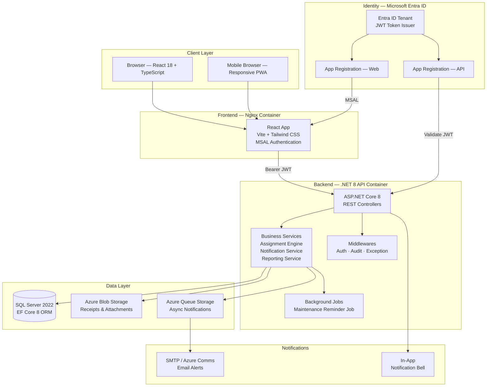
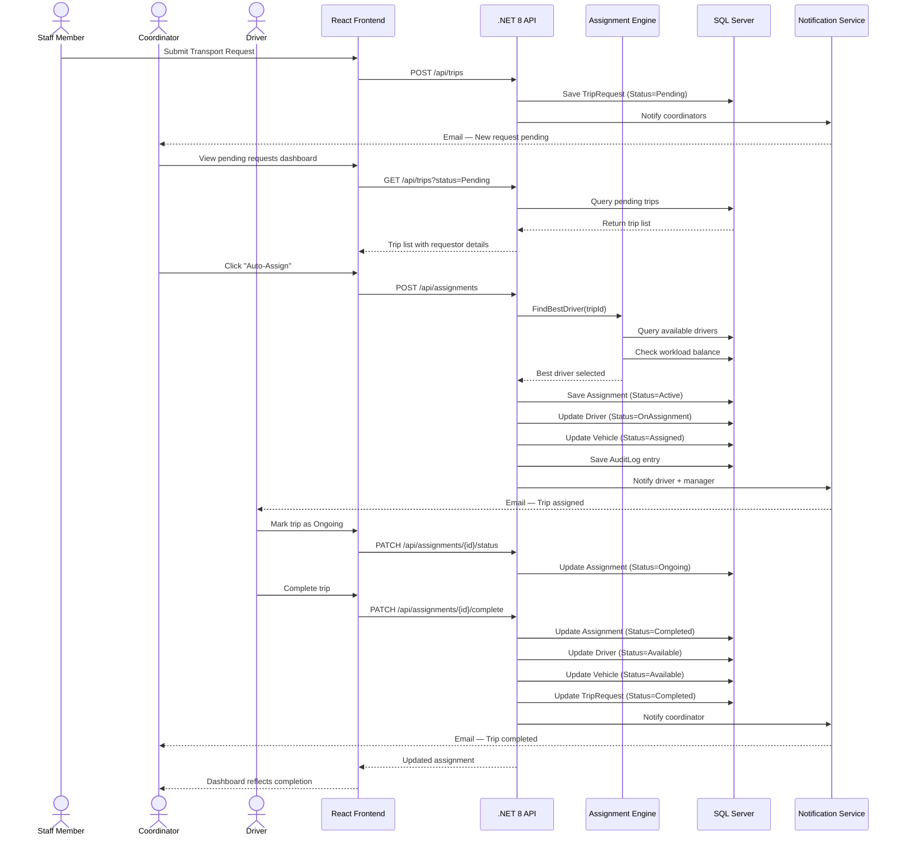
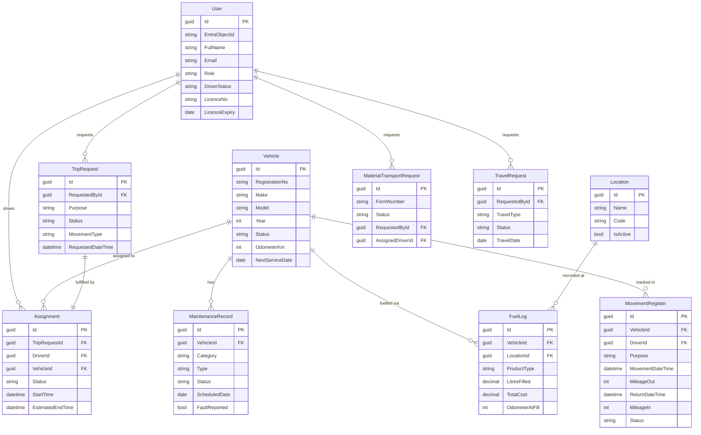

# Desicon Engineering — Logistics & Fleet Management Platform

> **Enterprise-grade logistics coordination system** built for Desicon Engineering's multi-site operations across Nigeria. Replaces manual spreadsheets and phone-based coordination with a centralised, real-time web platform.

---

## Table of Contents

- [Overview](#overview)
- [System Architecture](#system-architecture)
- [Request Lifecycle — Data Flow](#request-lifecycle--data-flow)
- [Core Modules](#core-modules)
- [Technology Stack](#technology-stack)
- [Database Schema](#database-schema)
- [Security & Access Control](#security--access-control)
- [Deployment](#deployment)
- [API Reference](#api-reference)
- [Project Structure](#project-structure)

---

## Overview

The Logistics & Fleet Management Platform digitises and centralises all logistics operations for Desicon Engineering across its Nigerian offices (Lagos, Port Harcourt, Abuja, Site Bonny, and field sites).

### Problems Solved

| Before | After |
|--------|-------|
| Driver availability tracked via phone calls | Real-time driver status dashboard |
| Vehicle assignments via WhatsApp messages | Automated assignment engine with audit trail |
| Maintenance reminders in paper notebooks | Scheduled maintenance tracking with email alerts |
| Fuel records in Excel spreadsheets per site | Centralised fuel logs per location with consolidated reporting |
| Movement records in gate logbooks | Digital movement register with mileage tracking |
| No visibility across locations | Management dashboard spanning all sites |

### Operational Locations

- **Desicon Lagos Office** — Head Office
- **Desicon PH Office** — Port Harcourt
- **Desicon Abuja Office** — Federal Capital Territory
- **Site Bonny** — Bonny Island project site
- **Others** — Field and ad-hoc locations

---

## System Architecture



---

## Request Lifecycle — Data Flow

How a **Transport Request** flows through the entire system from submission to completion:



---

## Core Modules

### Phase 1 — Foundation

| Module | Description |
|--------|-------------|
| **Driver Availability Dashboard** | Real-time status (Available, On Assignment, On Break, Off Duty) with auto-update on assignment |
| **Vehicle Management** | Fleet registry with chassis details, purchase year, colour, vehicle age, service intervals, and maintenance history per vehicle |
| **Trip Request Portal** | Staff-facing request form with SOP notices, predefined Nigerian locations, movement type classification, and departure scheduling |
| **Automated Assignment Engine** | Assigns available drivers and vehicles to approved trips; supports manual override with audit logging |
| **Maintenance Tracking** | Routine and fault-repair records per vehicle; upcoming/overdue reminders sent by email |
| **Fuel Log Management** | Per-location fuel tracking (Petrol/Diesel); odometer readings, mileage auto-calculation, gauge readings, cost centre tagging, location-specific and consolidated reporting |

### Phase 2 — Operations

| Module | Description |
|--------|-------------|
| **Material Transport Requests** | DEL-LG-FRM-009 three-level approval workflow: Requestor → HOD → GM Logistics → Driver Assignment |
| **Driver Performance Dashboard** | Trip history, incident tracking, accident-free streak calculator, severity-coded incident log |
| **Daily Work Schedule** | Weekly calendar grid with 9 assignment categories (Day Shift, Night Shift, Guest House Driver, Night Standby, Expatriate Driver, Management Driver, Project Assignment, Off Duty, Leave) |
| **Vehicle Repair History** | Per-vehicle maintenance history panel on the Vehicles page |

### Phase 3 — Advanced

| Module | Description |
|--------|-------------|
| **Travel & Accommodation** | Requests for Local/International flights, Hotel, Guesthouse, and Immigration — with manager approval and booking confirmation |
| **Project Materials Status Register** | Digital replacement for the project materials Excel tracker; tracks PO numbers, freight forwarders, ETD/ETA, Customs, BL/AWB numbers, delivery status |
| **Logistics Movement Register** | Gate-log style digital register capturing vehicle/driver, Time Out, Mileage Out, Time In, Mileage In, Purpose, Origin, Destination, Gate Pass — with one-click closure |

---

## Technology Stack

### Frontend
| Technology | Purpose |
|------------|---------|
| React 18 + TypeScript | UI framework |
| Vite | Build tool |
| Tailwind CSS | Utility-first styling |
| React Query (TanStack) | Server state management & caching |
| MSAL Browser v3 | Microsoft Entra ID authentication |
| Recharts | Dashboard charts |
| date-fns | Date formatting |
| react-hot-toast | User notifications |

### Backend
| Technology | Purpose |
|------------|---------|
| .NET 8 / ASP.NET Core | REST API framework |
| Entity Framework Core 8 | ORM + migrations |
| Microsoft Identity Web | JWT validation (Entra ID) |
| FluentValidation | Request validation |
| Azure Blob Storage SDK | File/receipt storage |
| SMTP / Azure Communication Services | Email notifications |

### Infrastructure
| Technology | Purpose |
|------------|---------|
| SQL Server 2022 | Primary database |
| Docker + Docker Compose | Local development & demo |
| Microsoft Azure | Production hosting |
| Azure App Service | API hosting |
| Azure Static Web Apps | Frontend hosting |
| Microsoft Entra ID | Identity & SSO |
| GitHub Actions | CI/CD pipeline |

---

## Database Schema

Key entities and their relationships:



---

## Security & Access Control

### Role-Based Access Control (RBAC)

| Role | Permissions |
|------|------------|
| **Driver** | View own assignments, update own status, submit trip requests |
| **Coordinator** | All driver permissions + manage schedules, log movements, manage fuel, view all drivers/vehicles |
| **Mechanic** | View vehicles, manage maintenance records |
| **Manager** | All coordinator permissions + approve requests, override assignments, register drivers, view reports |
| **Admin** | Full system access including user management, location config, audit logs |

### Security Implementation

- **Authentication** — Microsoft Entra ID (Azure AD) with PKCE flow via MSAL v3
- **Authorisation** — JWT Bearer token validation on every API endpoint; role claims from Entra ID token
- **Audit Trail** — Every assignment, status change, approval, and override is logged with user email, IP address, timestamp, and action description
- **Rate Limiting** — 60 requests/minute per authenticated user
- **HTTPS** — Enforced in production; all API communication encrypted
- **Data Protection** — SQL Server encryption at rest; Azure Blob Storage with private access

---

## Deployment

### Local Demo (Docker)

```bash
# 1. Clone the repository
git clone https://github.com/<your-org>/logistics-management-platform.git
cd logistics-management-platform

# 2. Copy environment template and fill in your Entra ID values
cp .env.docker .env

# 3. Start all services (SQL Server + API + React frontend + MailHog)
docker compose up --build

# 4. Open the app
open http://localhost:3100

# 5. View caught emails (maintenance reminders, assignment notifications)
open http://localhost:8025
```

The system auto-seeds on first start: 10 drivers, 8 vehicles, active assignments, maintenance records, and demo staff accounts.

### Production (Azure)

```
Azure App Service (Linux)   ←── .NET 8 API container
Azure Static Web Apps       ←── React frontend (Vite build)
Azure SQL Database          ←── SQL Server managed database
Azure Blob Storage          ←── Receipts, photos, attachments
Azure Communication Services ←── Email notifications
Microsoft Entra ID          ←── Authentication & SSO
GitHub Actions              ←── CI/CD pipeline (on push to main)
```

### Environment Variables

| Variable | Description |
|----------|-------------|
| `Sql__ConnectionString` | SQL Server connection string |
| `EntraId__TenantId` | Azure AD tenant ID |
| `EntraId__ClientId` | API app registration client ID |
| `Storage__ConnectionString` | Azure Blob/Queue storage |
| `Email__SmtpHost` | SMTP server for notifications |
| `Demo__SeedOnStartup` | `true` to auto-seed demo data on fresh DB |

---

## API Reference

The API follows RESTful conventions. Full Swagger UI is available at `/swagger` in development/Docker mode.

### Key Endpoints

| Method | Path | Description |
|--------|------|-------------|
| `GET` | `/api/drivers` | List all active drivers with status |
| `POST` | `/api/drivers` | Register a new driver |
| `PATCH` | `/api/drivers/{id}/status` | Update driver status |
| `GET` | `/api/vehicles` | List vehicles with optional status filter |
| `POST` | `/api/vehicles` | Add a new vehicle |
| `GET` | `/api/trips` | List trip requests with filters |
| `POST` | `/api/assignments` | Create assignment (triggers auto-assignment engine) |
| `PATCH` | `/api/assignments/{id}/status` | Update assignment status |
| `GET` | `/api/fuel` | Fuel logs with location/product/date filters |
| `POST` | `/api/fuel` | Log a fuel transaction |
| `GET` | `/api/locations` | List operational locations |
| `GET` | `/api/movement-register` | Movement register entries |
| `POST` | `/api/movement-register` | Log a vehicle movement |
| `PATCH` | `/api/movement-register/{id}/close` | Close movement (record Time In + Mileage In) |
| `GET` | `/api/material-transport` | Material transport requests |
| `POST` | `/api/material-transport/{id}/hod-approval` | HOD approve/reject |
| `POST` | `/api/material-transport/{id}/manager-approval` | Manager approve/reject |
| `GET` | `/api/reports/dashboard` | Aggregated dashboard summary |
| `GET` | `/api/reports/fuel/export` | Export fuel report (Excel) |
| `GET` | `/api/auth/me` | Resolve current user profile (first-login account linking) |

---

## Project Structure

```
logistics-management-platform/
├── src/
│   ├── api/                          # .NET 8 Web API
│   │   ├── Controllers/              # REST endpoints (17 controllers)
│   │   ├── Data/
│   │   │   ├── AppDbContext.cs       # EF Core context
│   │   │   ├── DatabaseSeeder.cs     # Startup data seeder
│   │   │   └── Migrations/          # EF Core migration history
│   │   ├── Models/
│   │   │   ├── Entities/            # EF Core entity classes
│   │   │   └── DTOs/               # Request/response records
│   │   ├── Services/
│   │   │   ├── AssignmentEngine/   # Auto-assignment logic
│   │   │   ├── NotificationService # Email + in-app notifications
│   │   │   ├── ReportingService    # Excel export generation
│   │   │   └── StorageService      # Azure Blob operations
│   │   ├── BackgroundJobs/         # Maintenance reminder scheduler
│   │   ├── Middleware/             # Audit + exception handling
│   │   └── Program.cs              # App bootstrap + DI
│   │
│   └── web/                         # React TypeScript frontend
│       └── src/
│           ├── pages/
│           │   ├── Dashboard/       # KPI cards + charts
│           │   ├── Drivers/         # Driver list + registration
│           │   ├── Vehicles/        # Fleet + repair history
│           │   ├── TripRequests/    # Request portal
│           │   ├── Assignments/     # Assignment management
│           │   ├── Maintenance/     # Service records
│           │   ├── Fuel/            # Fuel logs + location reports
│           │   ├── MaterialTransport/ # DEL-LG-FRM-009 workflow
│           │   ├── DriverSchedule/  # Weekly calendar
│           │   ├── DriverPerformance/ # KPIs + incident log
│           │   ├── MovementRegister/ # Gate movement log
│           │   ├── Travel/          # Travel & accommodation
│           │   ├── ProjectMaterials/ # Materials status tracker
│           │   └── Reports/         # Export + analytics
│           ├── components/          # Shared UI components
│           ├── services/api.ts      # All API calls + TypeScript types
│           └── auth/               # MSAL auth hooks
│
├── scripts/
│   └── seed-demo-data.sql          # Legacy seed SQL (superseded by DatabaseSeeder.cs)
├── docker-compose.yml              # Full local dev stack
├── .env.docker                     # Environment template
└── README.md                       # This file
```

---

## Built With

This platform was designed and built as an enterprise solution for **Desicon Engineering** to modernise logistics operations across its Nigerian multi-site operations. The architecture prioritises:

- **Scalability** — Cloud-native Azure deployment ready to scale with operational growth
- **Security** — Microsoft Entra ID SSO, RBAC, full audit trail on every action
- **Reliability** — EF Core migrations, health checks, retry-on-failure DB connections
- **Maintainability** — Clean separation of concerns across controllers, services, and repositories
- **Operational Fit** — Designed around real workflows from the Desicon logistics team

---

*Built with ❤️ for Desicon Engineering Logistics Department*
